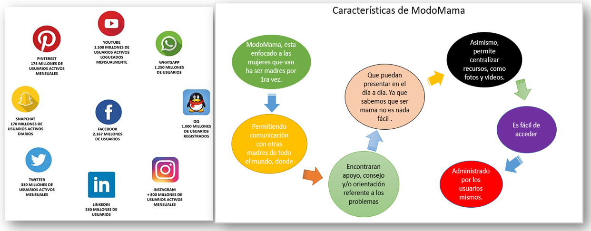
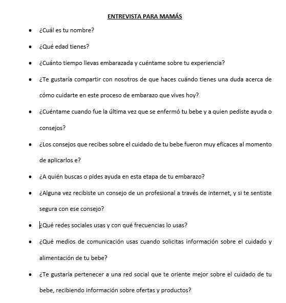

# Red Social - MODOMAMA
# UX

###  Definición del producto:
### Introducción
La llegada del primer bebé supone una gran felicidad para la pareja primeriza, pero también trae consigo una serie de miedos, que la madre vive especialmente. Cuando una mujer se convierte en madre, empieza una etapa llena de cambios y trabajo, mucho trabajo. En ocasiones, la responsabilidad puede llegar a abrumar y a hacerle sentir que no puede con todo.

Debido a este problema nace `ModoMama` una red social especialmente para mujeres que pasan por esta etapa, un espacio donde puedan compartir sus temores, dudas, consultas, etc. Tanto con otras mujeres de la misma situación hasta especialistas en la materia.

###  Caracteristicas básicas que tiene una red social
Actualmente contamos con varias redes sociales todas tienen en común la de contactarse con otras personas, pero con diferente enfoque. Por ejemplo Instagram esta enfocado a compartir imagenes, Facebook esta enfocado a contactar personas de diferentes partes, etc. Nuestra aplicación `ModoMama` esta enfocado a un publico en especifico y son las madres primerizas. Acontinuación se detalla los principales elementos y/o caracteristicas que tiene nuestra aplicación web. 

###  Principales usuarios de producto
Nuestros principales usuarios vienen ha ser las madres primerizas, especialistas y marcas relacionados al cuidado del bebe. 

###  Principales funcionalidades del producto

###  Benchmark de las principales redes sociales
Durante este análisis revisamos:

* Nuestros productos y prototipos actuales y anteriores
* Los productos de la competencia directa e indirecta

Este análisis nos ayudará a saber cómo estamos en relación a la competencia. Al final de este análisis podremos realizar una tabla como el ej, que nos ayude a tener un mejor panorama.

Para este proyecto usamos como referencia tres paginas, los cuales usamos como referencia y/o guia.

###  Resumen de entrevistas con usuarios

###  User Experience Design

Para desarrollar el proyecto comenzamos diseñando el prototipo de baja y alta fidelidad. Asimismo realizanos entrevistas a mujeres en esta condiciòn.

He aqui una muestra del prototipo de alta fidelidad ya con todas las pautas que recibimos en las entrevistas.

###  Link/screenshots del prototipo de alta fidelidad
A continuación se adjunta los links donde se pueden visualizar el prototipo de alta fidelidad (Login - pagina principal), hecho en Figma.

#### Login
[View - Desktop](https://www.figma.com/file/gyFN3dm2XIxMLAHPC1qtKY/material-kit-free-(Copy)?node-id=0%3A880 "View - Desktop")
[View - Tablet](https://www.figma.com/file/gyFN3dm2XIxMLAHPC1qtKY/material-kit-free-(Copy)?node-id=0%3A1258 "View - Tablet")
[View - Mobile](https://www.figma.com/file/gyFN3dm2XIxMLAHPC1qtKY/material-kit-free-(Copy)?node-id=0%3A1472 "View - Mobile")

#### Pagina Principal
[View - Desktop](https://www.figma.com/file/gyFN3dm2XIxMLAHPC1qtKY/material-kit-free-(Copy)?node-id=0%3A1030 "View - Desktop")
[View - Tablet](https://www.figma.com/file/gyFN3dm2XIxMLAHPC1qtKY/material-kit-free-(Copy)?node-id=0%3A1095 "View - Tablet")
[View - Mobile](https://www.figma.com/file/gyFN3dm2XIxMLAHPC1qtKY/material-kit-free-(Copy)?node-id=0%3A1313 "View - Mobile")