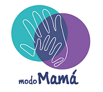
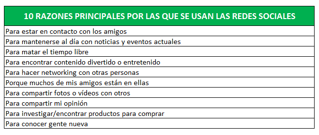
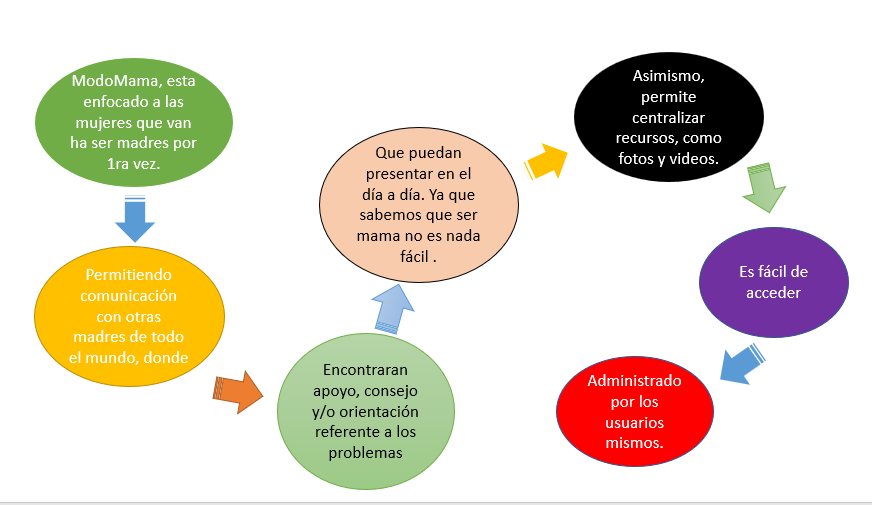
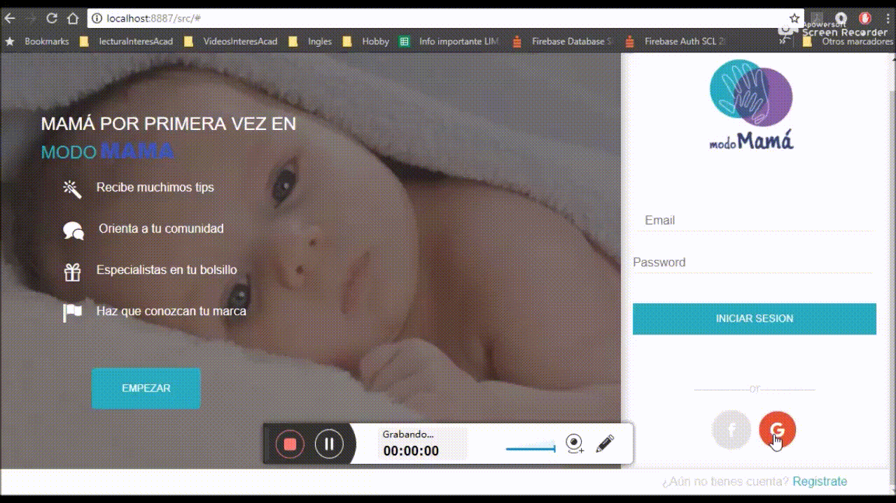
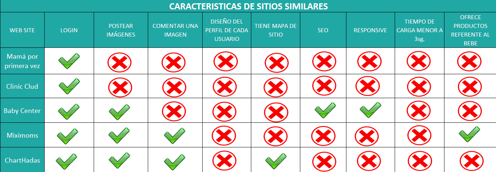
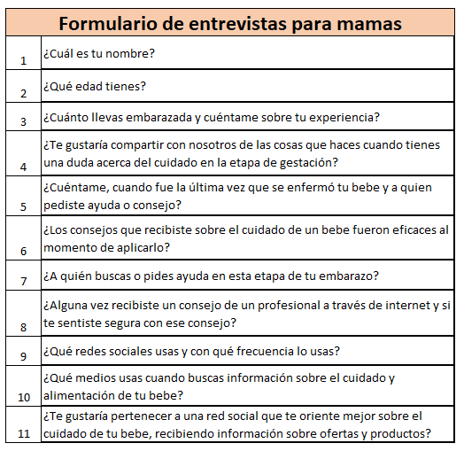
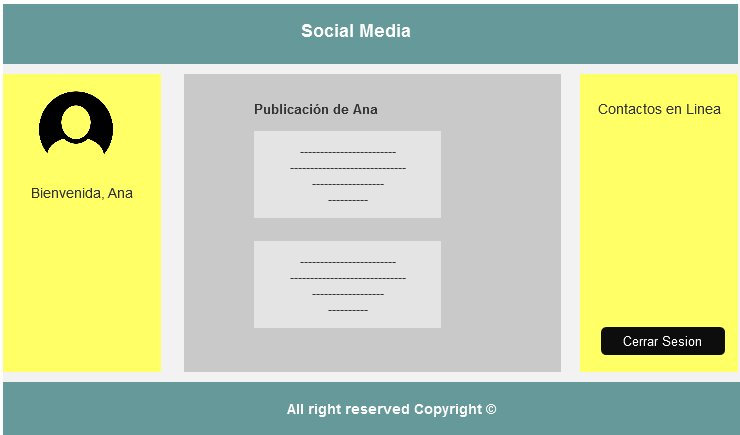

# Proyecto - Red Social
### Introducción

Bienvenidos a `ModoMama` una red social creada especialmente para mamis. En este espacio podrás compartir tus dudas y temores con otras MUJERES como tú, tendrás a tu alcance muchos tips y orientación sobre el cuidado del recién nacido, comentar y dar tu apoyo con un me gusta a tus posts favoritos y como si fuera poco podrás estar en contacto con especialistas como médicos, nutricionistas y pediatras. A su vez encontraras productos de alta gama para el cuidado del recién nacido. 

###  Definición del producto:

Hoy en día la mayoría de las personas por no decir todas usan redes sociales, a su vez esto genera un gran mercado online donde hay mucha demanda de todo tipo y los beneficiarios vienen a ser un grupo de personas que forman una comunidad tras otra lo cual va cada vez más en aumento.
Después de este análisis e investigación mi equipo y yo nos dimos cuenta que son más la cantidad de mujeres que usan redes sociales a la fecha  a comparación de los hombres según estudio en https://www.brandwatch.com/es/blog/redes-sociales-hombres-mujeres/  `(Brandwatch Analytics)` motivo por lo cual nuestra aplicación esta segmentada a ellas. 
Sabemos que las mujeres tienen el don más bello y hablamos de concebir una nueva vida, toda mujer en algún momento de su vida pasa por esta etapa y es ahí donde surgen muchas dudas y preguntas respecto al embarazo, al cuidado del recién nacido, etc. Y es muy normal que queramos saberlo todo ya que queremos hacer bien las cosas desde un principio, pero esto no siempre es posible debido a varios factores como el horario del trabajo, los estudios, los que haceres del hogar entre otros; es ahí donde nace la idea de realizar una red social especialmente para mamis. 

###  Elementos básicos que tiene una red social
Según las investigaciones realizadas se concluye que los elementos básicos por el cual un usuario usa una red social son los siguientes:  

###  Características de `ModoMama`

En base a lo mencionado anteriormente se procedió a definir las características de nuestra aplicación web.

###  Principales usuarios del producto
**Usuarios Principales:** El producto está segmentada a mujeres en etapa de gestación (post y prenatal).

**Usuarios Secundarios:** Nuestra aplicación tiene como enfoque secundario aplicar un modelo de negocio lo cual consiste en la publicidad de Marcas como Johnson baby, Haggis, etc. dedicados al cuidado del bebe, así como también a estar en contacto con especialistas como pedíatras, médicos y nutricionistas que brindan sus servicios y/o consejos en línea.

### ¿Como descubriste las necesidades de los usuarios?
Al realizar la investigación nos dimos cuenta de que hay una gran demanda descubierta en el mundo de las mujeres y las redes sociales, pues resulta que hay pocas plataformas para madres que permitan interactuar, participar y compartir las dudas y/o miedos que puedan presentar durante la etapa de concepción o crianza de una nueva vida.

### ¿Qué problema resuelve el producto para los usuarios?
Nuestro producto brinda al usuario ahorrar tiempo, dinero y evitar malos ratos esperando largas colas para reservar una cita o consulta ya sea con el pediatra, nutricionista o médico.  Con ModoMama nuestros usuarios tendrán al alcance todos estos servicios en un solo lugar las 24 horas y 07 días a la semana.

### Cuáles son los objetivos de estos usuarios en relación con el producto

### Cuáles son las principales funcionalidades del producto y cuál es su prioridad

Nuestra aplicación tiene como prioridad facilitar la vida cotidiana de las madres y en cuanto a la funcionalidad se tomó en cuenta las 10 principales razones que tienen los usuarios para usar una red social y las necesidades y/o dificultades que pueda presentar una madre durante la etapa de gestación y/o nacimiento de un bebe. He aqui un `Demo` de la funcionalidad de nuestra aplicación.

### Cómo verificaste que el producto les está resolviendo sus problemas

Para verificar si el producto está generando satisfacción y/o ayuda a nuestros usuarios se procedió a realizar entrevistas y pedir feedback con fines de mejora y retroalimentación.

### Cómo te asegurarás de que estos usuarios usen este producto
La forma de asegurar el uso de nuestro producto es haciendo que el producto sea lo más amigable y sencillo posible. Así como ofrecer descuentos en accesorios para bebes y citas con el pediatra, nutricionista, etc. Todo esto patrocinado por los mismos.

###  Benchmark de las principales redes sociales
Antes de definir las características y estructura de nuestro producto final, realizamos un análisis extensivo de nuestras competencias directas e indirectas.
Es así que llegamos a realizar un Benchmark donde se visualiza las principales características con las que cuentan cada una de ellas, esto nos sirvió de gran ayuda para poder definir nuestra estructura y modelo de negocio de nuestro producto final. 
En la imagen pueden visualizar los diferentes sitios web que tomamos como referencia para nuestro prototipo.

###  Resumen de entrevistas con usuarios
Para un mayor acercamiento con nuestros usuarios realizamos una pequeña encuesta, el cual nos permitió conocer de forma directa las necesidades y problemas de nuestras futuras usuarias. 

###  Link/screenshots del prototipo de alta fidelidad
He aqui una muestra del prototipo de baja fidelidad.

A continuación se adjunta los links donde se pueden visualizar el prototipo de alta fidelidad (Login - pagina principal), hecho en Figma.

#### Login
[View - Desktop](https://www.figma.com/file/gyFN3dm2XIxMLAHPC1qtKY/material-kit-free-(Copy)?node-id=0%3A880 "View - Desktop")
[View - Tablet](https://www.figma.com/file/gyFN3dm2XIxMLAHPC1qtKY/material-kit-free-(Copy)?node-id=0%3A1258 "View - Tablet")
[View - Mobile](https://www.figma.com/file/gyFN3dm2XIxMLAHPC1qtKY/material-kit-free-(Copy)?node-id=0%3A1472 "View - Mobile")

#### Pagina Principal
[View - Desktop](https://www.figma.com/file/gyFN3dm2XIxMLAHPC1qtKY/material-kit-free-(Copy)?node-id=0%3A1030 "View - Desktop")
[View - Tablet](https://www.figma.com/file/gyFN3dm2XIxMLAHPC1qtKY/material-kit-free-(Copy)?node-id=0%3A1095 "View - Tablet")
[View - Mobile](https://www.figma.com/file/gyFN3dm2XIxMLAHPC1qtKY/material-kit-free-(Copy)?node-id=0%3A1313 "View - Mobile")

### Conclusiones de testing con el prototipo de alta fidelidad con usuarios
### Conclusiones de testing con el producto en HTML