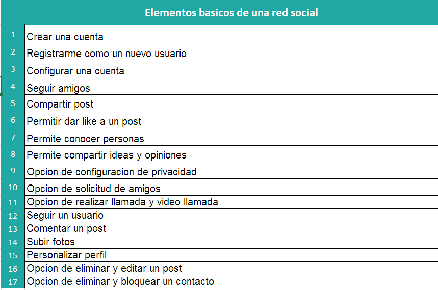
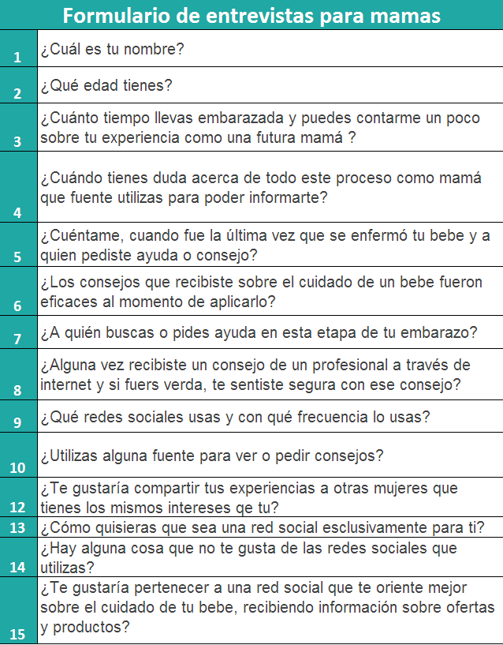
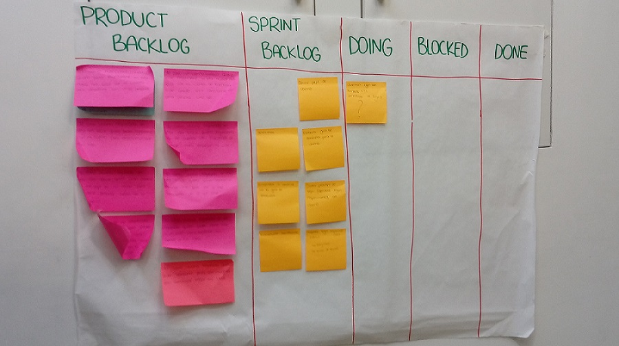
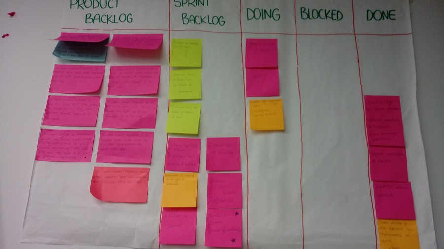
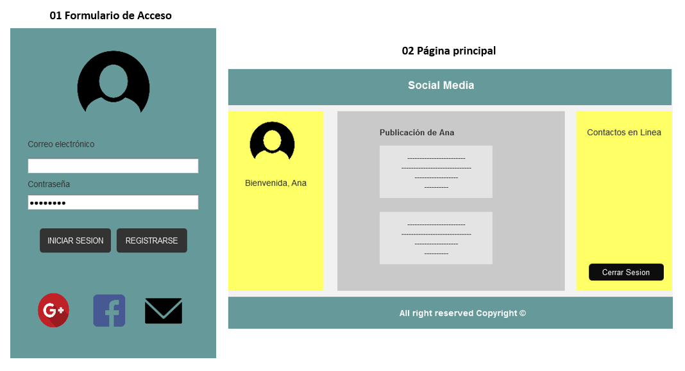
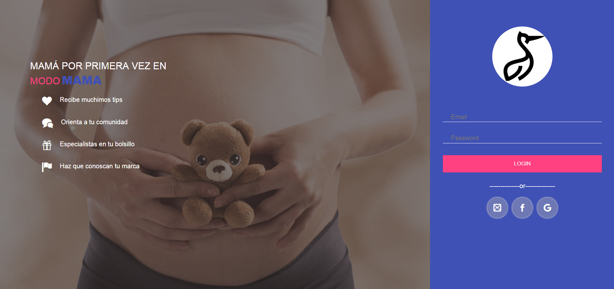
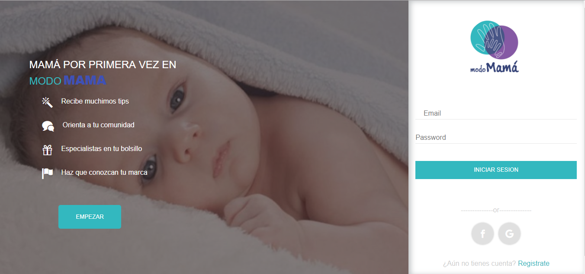
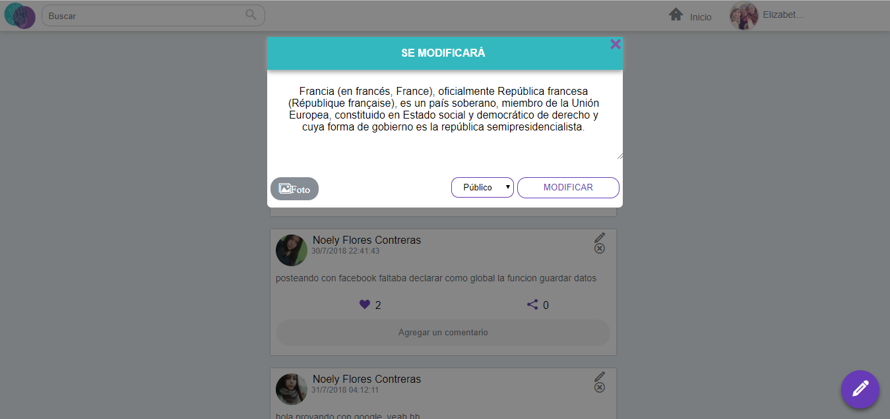

# Proyecto - Red Social
### Introducción

Bienvenidos a `ModoMama¡¡` una red social creada especialmente para madres primerizas. En este espacio podrás compartir tus dudas y temores con otras MUJERES como tú, tendrás a tu alcance  tips y orientación sobre el cuidado del recién nacido, comentar, dar like a  posts favoritos,asi mismo podrás estar en contacto con especialistas como médicos, nutricionistas y pediatras. A la vez encontraras productos de alta gama para el cuidado de tu bebe.

###  Definición del producto:

Hoy en día la mayoría de las personas por no decir todas usan redes sociales, a su vez esto genera un gran mercado online donde hay mucha demanda de todo tipo y los beneficiarios vienen a ser un grupo de personas que forman una comunidad tras otra lo cual va cada vez más en aumento.
Después de este análisis e investigación mi equipo y yo nos dimos cuenta que son más la cantidad de mujeres que usan redes sociales a la fecha  a comparación de los hombres según estudio en https://www.brandwatch.com/es/blog/redes-sociales-hombres-mujeres/  `(Brandwatch Analytics)` motivo por lo cual nuestra aplicación esta segmentada a ellas. A continuación se visualiza un cuadro comparativo entre hombres y mujeres que usan las redes sociales.

**Fuente:`Brandwatch Analytics`**

Sabemos que las mujeres tienen el don más bello y hablamos de concebir una nueva vida, toda mujer en algún momento de su vida pasa por esta etapa y es ahí donde surgen muchas dudas y preguntas respecto al embarazo, al cuidado del recién nacido, etc.Es muy normal que queramos saberlo todo ya que queremos hacer bien las cosas desde un principio, pero esto no siempre es posible debido a varios factores como el horario del trabajo, los estudios, los que haceres del hogar entre otros; es ahí donde nace la idea de realizar una red social especialmente para mamis. 

###  Elementos básicos que tiene una red social
Según las investigaciones realizadas se concluye que los elementos básicos por el cual un usuario usa una red social son los siguientes:  

###  Características de `ModoMama`

En base a lo mencionado anteriormente se procedió a definir las características de nuestra aplicación web.

###  Principales usuarios del producto
**Usuarios Principales:** El producto está orientado a mujeres en etapa de gestación (post y prenatal) que tienen la necesidad de informarse sobre el cuidado de su bebe.

**Usuarios Secundarios:** Nuestra aplicación tiene como enfoque secundario aplicar un modelo de negocio lo cual consiste en la publicidad de Marcas como Johnson baby, Haggis, etc. Dedicados al cuidado del bebe, así mismo conectar a madres con especialistas como pedíatras, médicos y nutricionistas que brindan sus servicios y/o consejos en línea.

### ¿Como descubriste las necesidades de los usuarios?
Al realizar la investigación nos dimos cuenta de que hay una gran demanda descubierta en el mundo de las mujeres y las redes sociales, pues resulta que hay pocas plataformas para madres que permitan interactuar, participar y compartir las dudas y/o miedos que puedan presentar durante la etapa de concepción o crianza de una nueva vida.

### ¿Qué problema resuelve el producto para los usuarios?
Nuestro producto brinda al usuario ahorrar tiempo, dinero y evitar malos ratos esperando largas colas para reservar una cita o consulta ya sea con el pediatra, nutricionista o médico.  Con ModoMama nuestros usuarios tendrán al alcance todos estos servicios en un solo lugar las 24 horas y 07 días a la semana.

### Cuáles son los objetivos de estos usuarios en relación con el producto
Al finalizar el análisis e investigación llegamos a la conclusión de que nuestros usuarios desean una aplicación que les permita compartir sus dudas, realizar consultas y sobre todo que esté disponible las 24 horas y 07 días de la semana.

### Cuáles son las principales funcionalidades del producto y cuál es su prioridad

Nuestra aplicación tiene como prioridad facilitar la vida cotidiana de las madres y en cuanto a la funcionalidad se tomó en cuenta las 10 principales razones que tienen los usuarios para usar una red social y las necesidades y/o dificultades que pueda presentar una madre durante la etapa de gestación y/o nacimiento de un bebe. He aqui un `Demo` de la funcionalidad de nuestra aplicación.

### Cómo verificaste que el producto les está resolviendo sus problemas

Para verificar si el producto está generando satisfacción y/o ayuda a nuestros usuarios se procedió a realizar entrevistas y pedir feedback con fines de mejora y retroalimentación.

### Cómo te asegurarás de que estos usuarios usen este producto
La forma de asegurar el uso de nuestro producto es haciendo que el producto sea lo más amigable y sencillo posible. Así como ofrecer descuentos en accesorios para bebes y citas con el pediatra, nutricionista, etc. Todo esto patrocinado por los mismos.

###  Benchmark de las principales redes sociales
Antes de definir las características y estructura de nuestro producto final, realizamos un análisis extensivo de nuestras competencias directas e indirectas.
Es así que llegamos a realizar un Benchmark donde se visualiza las principales características con las que cuentan cada una de ellas, esto nos sirvió de gran ayuda para poder definir nuestra estructura y modelo de negocio de nuestro producto final. 
En la imagen pueden visualizar los diferentes sitios web que tomamos como referencia para nuestro prototipo.

###  Resumen de entrevistas con usuarios
Para un mayor acercamiento con nuestros usuarios realizamos una pequeña entrevista, el cual nos permitió conocer de forma detallada las necesidades y problemas de nuestras futuras usuarias. 

### Planificación de actividades
Al finalizar las entrevistas e investigaciones realizamos la planificacion de las tareas, para ello utilizamos como herramienta el `Backlog .`

**Sprint 01**

**Sprint 02**

###  Prototipos

**Prototipo de Baja Fidelidad**

 En base a las entrevistas e investigacion realizamos nuestro primer prototipo de baja fidelidad hecho en `en Axure RP 8`

**Prototipo de Alta Fidelidad**

A continuación se adjunta los links donde se pueden visualizar los prototipos de alta fidelidad hechos en Figma para los diferentes dispositivos ya sea Computadora, tablet o celuar.

#### Login
[Vista - Computadora](https://www.figma.com/file/gyFN3dm2XIxMLAHPC1qtKY/material-kit-free-(Copy)?node-id=0%3A880 "View - Desktop")

[Vista - Tablet](https://www.figma.com/file/gyFN3dm2XIxMLAHPC1qtKY/material-kit-free-(Copy)?node-id=0%3A1258 "View - Tablet")

[Vista - Celular](https://www.figma.com/file/gyFN3dm2XIxMLAHPC1qtKY/material-kit-free-(Copy)?node-id=0%3A1472 "View - Mobile")

#### Pagina Principal
[Vista - Computadora](https://www.figma.com/file/gyFN3dm2XIxMLAHPC1qtKY/material-kit-free-(Copy)?node-id=0%3A1030 "View - Desktop")

[Vista - Tablet](https://www.figma.com/file/gyFN3dm2XIxMLAHPC1qtKY/material-kit-free-(Copy)?node-id=0%3A1095 "View - Tablet")

[Vista - celular](https://www.figma.com/file/gyFN3dm2XIxMLAHPC1qtKY/material-kit-free-(Copy)?node-id=0%3A1313 "View - Mobile")

### Primer testing  de alta fidelidad con usuarios en HTML  
La red Social ModoMamá permite la comunicacion de madres primerizas con especialistas. Donde de postean dudas y consejos sobre el cuidado del bebe.

Las observaciones siguientes son gracias al testing con nuestra Jedi Mariana y una mamá con un hijo de 4 meses.

* En la imagen se puede visualizar que los colores de la RedSocial no tiene relación alguna sobre maternidad, el placeholder para escribir el correo electronicó y la contraseña no es visible para el usuario.  Asi mismo el logo de la RedSocial hace referencia a otros temas como aves. 

* Cuando el usuario desea registrarse a la redSocial no hay ningún texto o botón que indique donde debe seleccionar generando confución. 

* El usuario no tiene ninguna opción para poder ver post públicos de los usuarios de la redSocial.

* Algunos mensajes de error se visualizaban de color negro que te empedian la legibilidad del mensaje

### Conclusiones de testing con el prototipo de alta fidelidad con usuarios

Luego de recibir los feeback de la penúltima versión de la red Social, seleccionamos nuevos colores, el logo y modificaciones en el muro de acuerdo a la orientación del producto. 
* #### Colores 
Gracias a los usuarios se pudo determinar los colores principales de modoMama, tomando en cuenta la paleta de colores recomendados por UX. El color morado por la elegancia, lo cual hace referencia al sexo femenino, así mismo el color celeste pálido que representa la pureza y el sexo masculino de un bebe. 
* #### Logo 
También se hizo cambios en el logo de la red Social con dos círculos que hacen referencia al hijo y la madre unidos con unas manos al medio que representa el lazo maternal.
* #### Muro
La página principal (muro) se asemeja a las redes sociales más usadas en la actualidad como Facebook, Twitter e Instagram en la facilidad de uso, la utilización de Pop Up para postear, eliminar y editar un Post, buscar un usuario y la forma de configurar una cuenta (como ir a perfil y cerrar sesión). Tiene bordes grises para hacer la diferencia entre las distintos formularios y un icono al extremo inferior de la página para el fácil acceso a la publicación de un post, los iconos ayudan a percibir la acción que se desea realizar. Estas características se consideraron porque nuestras usuarias están más relacionadas a las redes sociales mencionadas anteriormente.
* #### Sección Modificar
 

La primera percepción de una persona que utilizará una nueva red social es que se asemeje a una que ya utiliza o al que se sienta más familiarizado. Nuestras madres primerizas tienen una edad aproximada entre 18 a 33 años eso indica que un gran porcentaje conoce o utiliza Facebook, Twitter, etc. 
De acuerdo al requerimiento del Readme de Laboratoria en el proyecto actual se especifica modificar post in place, este ítem  se consideró en el proyecto utilizando un  Pop Up semejante al de Facebook por los requerimientos de nuestros usuarios ya que comprendemos que estan familiarizados con este tipo de interactividad. 

